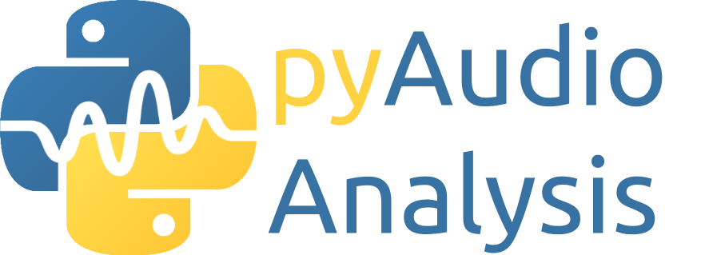

#  A Python library for audio feature extraction, classification, segmentation and applications

*This doc contains general info. Click [here](https://github.com/tyiannak/pyAudioAnalysis/wiki) for the complete wiki. For a more generic intro to audio data handling read [this article](https://hackernoon.com/audio-handling-basics-how-to-process-audio-files-using-python-cli-jo283u3y)*

## News
 * If you like this library and [my articles](https://hackernoon.com/u/tyiannak), please support me at the hackernoon [ML Writer of the Year](https://noonies.tech/award/ml-writer-of-the-year) 
  * [2020-09-12] Read [this hackernoon article titled "Intro to audio analysis"](https://hackernoon.com/intro-to-audio-analysis-recognizing-sounds-using-machine-learning-qy2r3ufl) for an intro to theory and practice of audio feature extraction, classification and segmentation.
 * Special issue in [Pattern Recognition in Multimedia Signal Analysis](https://www.mdpi.com/journal/applsci/special_issues/Multimedia_Signal), Deadline 30 November 2020
 * [2019-11-19] Major lib refactoring. Please report any issues or inconsistencies in the documentation.  
 * Check out [paura](https://github.com/tyiannak/paura) a python script for realtime recording and analysis of audio data
 * [2018-08-12] pyAudioAnalysis now ported to Python 3

## General
pyAudioAnalysis is a Python library covering a wide range of audio analysis tasks. Through pyAudioAnalysis you can:
 * Extract audio *features* and representations (e.g. mfccs, spectrogram, chromagram)
 * *Train*, parameter tune and *evaluate* classifiers of audio segments
 * *Classify* unknown sounds
 * *Detect* audio events and exclude silence periods from long recordings
 * Perform *supervised segmentation* (joint segmentation - classification)
 * Perform *unsupervised segmentation* (e.g. speaker diarization) and extract audio *thumbnails*
 * Train and use *audio regression* models (example application: emotion recognition)
 * Apply dimensionality reduction to *visualize* audio data and content similarities

## Installation
 * Clone the source of this library: `git clone https://github.com/tyiannak/pyAudioAnalysis.git`
 * Install dependencies: `pip install -r ./requirements.txt `
 * Install using pip: `pip install -e .`

## An audio classification example
> More examples and detailed tutorials can be found [at the wiki](https://github.com/tyiannak/pyAudioAnalysis/wiki)

pyAudioAnalysis provides easy-to-call wrappers to execute audio analysis tasks. Eg, this code first trains an audio segment classifier, given a set of WAV files stored in folders (each folder representing a different class) and then the trained classifier is used to classify an unknown audio WAV file

```
from pyAudioAnalysis import audioTrainTest as aT
aT.extract_features_and_train(["classifierData/music","classifierData/speech"], 1.0, 1.0, aT.shortTermWindow, aT.shortTermStep, "svm", "svmSMtemp", False)
aT.file_classification("data/doremi.wav", "svmSMtemp","svm")
Result:
(0.0, array([ 0.90156761,  0.09843239]), ['music', 'speech'])
```

In addition, command-line support is provided for all functionalities. E.g. the following command extracts the spectrogram of an audio signal stored in a WAV file: `python audioAnalysis.py fileSpectrogram -i data/doremi.wav`

## Further reading

Apart from this README file, to bettern understand how to use this library one should read the following:
  * [Audio Handling Basics: Process Audio Files In Command-Line or Python](https://hackernoon.com/audio-handling-basics-how-to-process-audio-files-using-python-cli-jo283u3y), if you want to learn how to handle audio files from command line, and some basic programming on audio signal processing. Start with that if you don't know anything about audio. 
  * [Intro to Audio Analysis: Recognizing Sounds Using Machine Learning](https://hackernoon.com/intro-to-audio-analysis-recognizing-sounds-using-machine-learning-qy2r3ufl) This goes a bit deeper than the previous article, by providing a complete intro to theory and practice of audio feature extraction, classification and segmentation (includes many Python examples).
 * [The library's wiki](https://github.com/tyiannak/pyAudioAnalysis/wiki)
 * [How to Use Machine Learning to Color Your Lighting Based on Music Mood](https://hackernoon.com/how-to-use-machine-learning-to-color-your-lighting-based-on-music-mood-bi163u8l). An interesting use-case of using this lib to train a real-time music mood estimator.
  * A more general and theoretic description of the adopted methods (along with several experiments on particular use-cases) is presented [in this publication](http://journals.plos.org/plosone/article?id=10.1371/journal.pone.0144610). *Please use the following citation when citing pyAudioAnalysis in your research work*:
```
@article{giannakopoulos2015pyaudioanalysis,
  title={pyAudioAnalysis: An Open-Source Python Library for Audio Signal Analysis},
  author={Giannakopoulos, Theodoros},
  journal={PloS one},
  volume={10},
  number={12},
  year={2015},
  publisher={Public Library of Science}
}
```

For Matlab-related audio analysis material check  [this book](http://www.amazon.com/Introduction-Audio-Analysis-MATLAB%C2%AE-Approach/dp/0080993885).

## Author


[Theodoros Giannakopoulos](https://tyiannak.github.io),
Director of Machine Learning at [Behavioral Signals](https://behavioralsignals.com)
